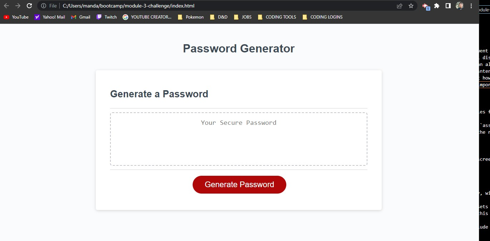

# module-3-challenge
Password Generator

## Description

- What was your motivation? I went outside of my comfort zone on this one and added random titles to the prompts that will display within the questions
- This program should provide an almost infinite number of randomly generated passwords for any persons who may need consisntent security generators or something.
- I learned during this project how to properly first build a function for something before calling it later on. This was important for me during the "Math.Random" portions.

## Usage

I'm sure there are many uses for such a project, however i think sopme of the best cases would be some kind of security program that can use this smaller program to generate quantum passwords in the future?

## Credits

Thank you for taking your time,

Alec Gomez

## License
MIT License